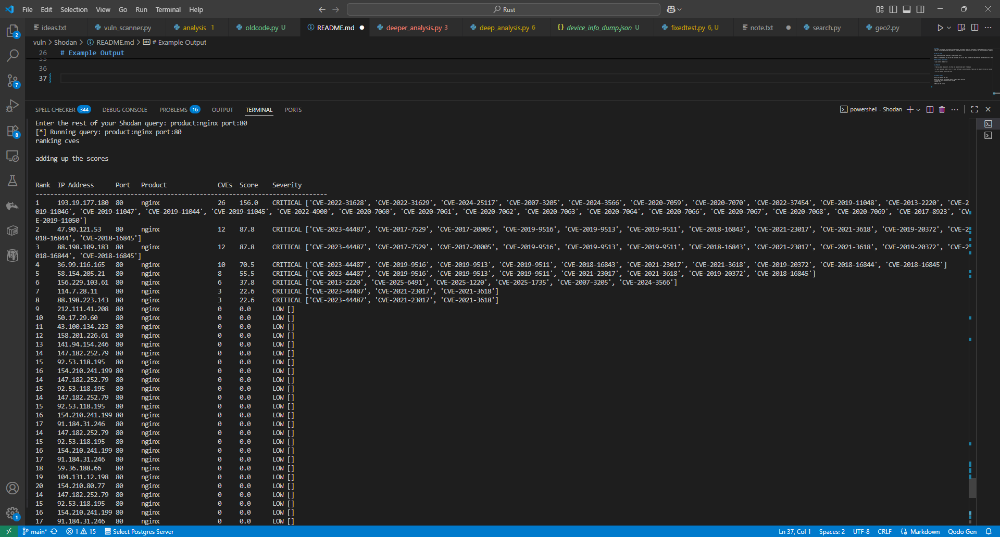

# Shodan
This tool uses Shodan to automate the discovery, enrichment, and risk assessment of exposed devices on the internet. The solution collects device data, extracts and ranks vulnerabilities (CVEs), and generates clear reports, including CSV and JSON exports, enabling efficient cybersecurity analysis and decision-making. Keep in mind that while it does display the CVEs, the program also colletcs all the data into a json and csv file. (hopefully for good)

## How it works

This program works by entering a normal shodan query

There is a example of how to use the tool when you run it. This is the link the official search query docs. https://www.shodan.io/search/examples

# Pip Install requirments

- pip install shodan rich

# IMPORTANT

- YOU WILL NEED AN API KEY, THE FREE KEY DOES NOT WORK WITH PYTHON API

- It will take some time to run. I'm using NIST api to score the CVEs. Thats why the amount returned is limited to 40, and there is a 6 second pause between each request. Don't want it to look like an attack

- NOT ALL QUERIES WILL RETURN CVEs

# Running The Program

Just do python run deep_analysis.py

# Example Output

Enter your Shodan API key: 

Enter the rest of your Shodan query: product:nginx port:80
[*] Running query: product:nginx port:80
ranking cves 

adding up the scores 

# Have more fun

This program isn't just for finding a cve

https://github.com/jakejarvis/awesome-shodan-queries?tab=readme-ov-file

# Report_gen.py

This file is responsible for generating the report. It takes the result dictionary and formats it into easy to read security report, as well as saving it to files. All that is needed is to pass the result dictionary, and it will handle the rest. Keep in mind that it only takes in a single dictionary, so you would need to go throug the json file and extract the dictionary you want to make a report for.